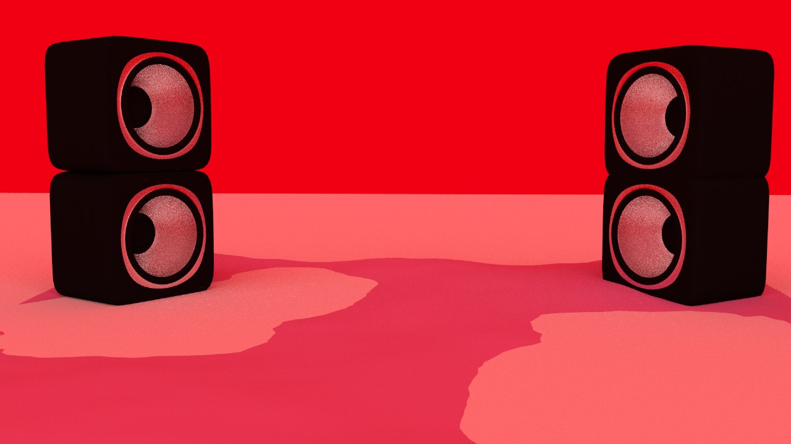

# NVIDIA Omniverse digital twin Assignment

## Overview

This repository contains a render of a speaker against a vivid red background.

## Idea and Inspiration

The inspiration for this assignment stems from the following concepts:

- I made this render to see how a dual speaker setup would look like and to check what would be the optimal placement of speaker would be for my case.
- I made this render in blender with the help of my friend Ravi who is good at 3D design and imported the 3D assets into Nvidia omniverse

